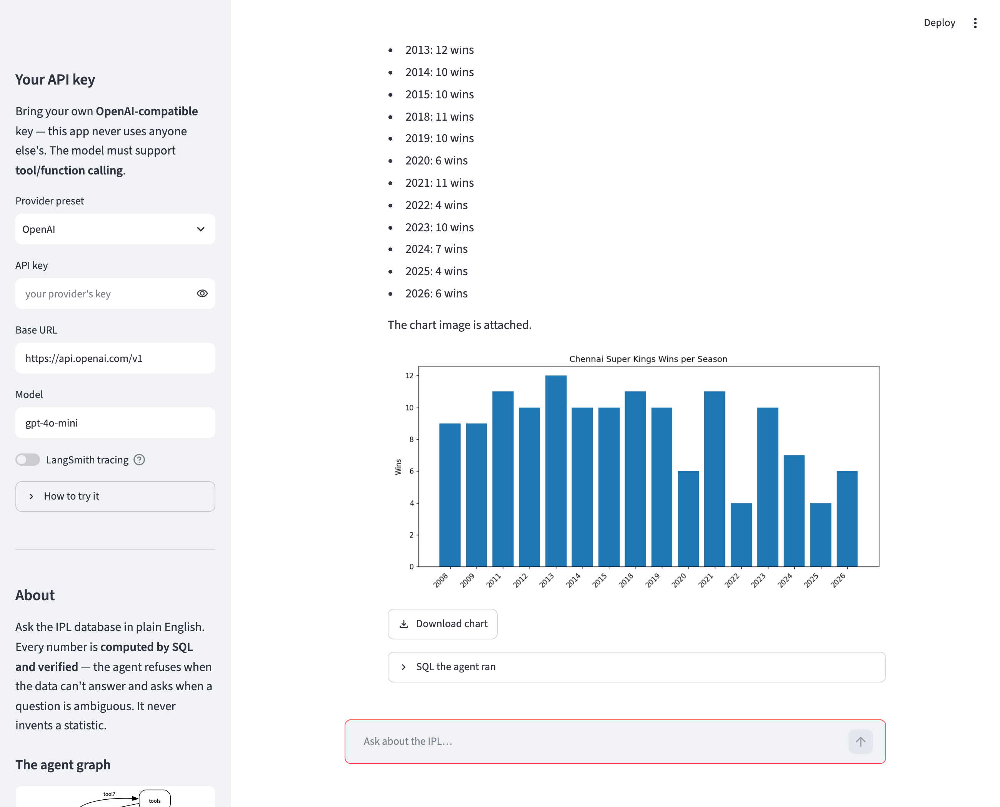
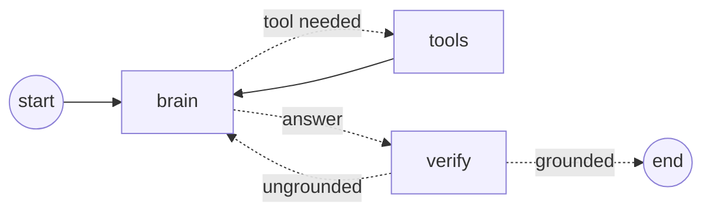
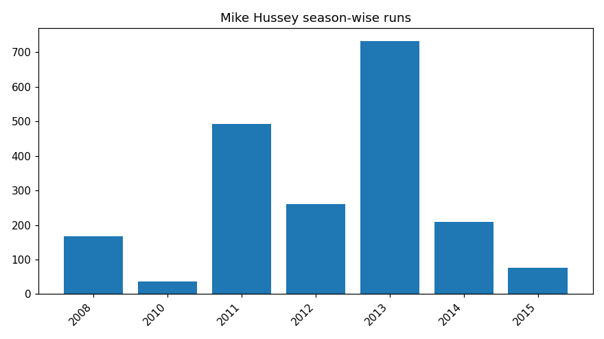
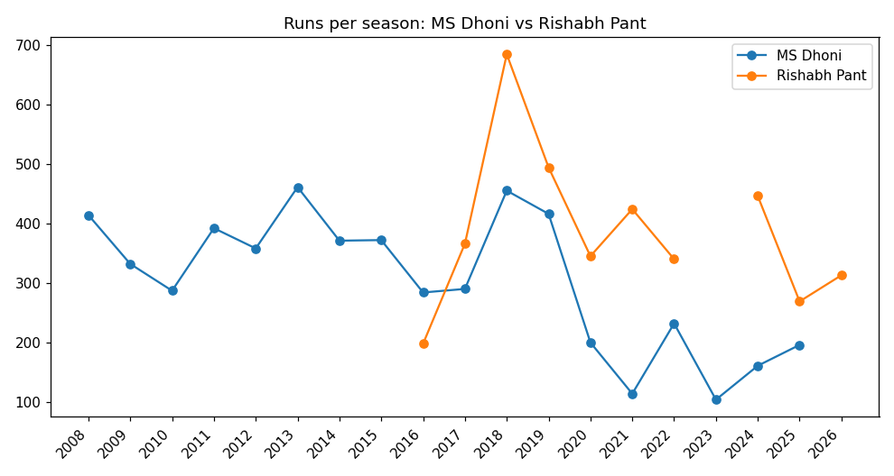
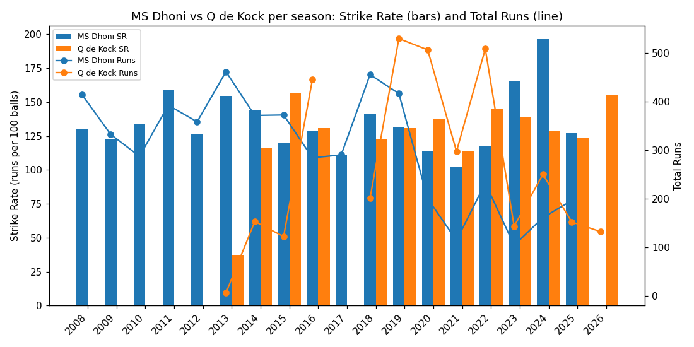
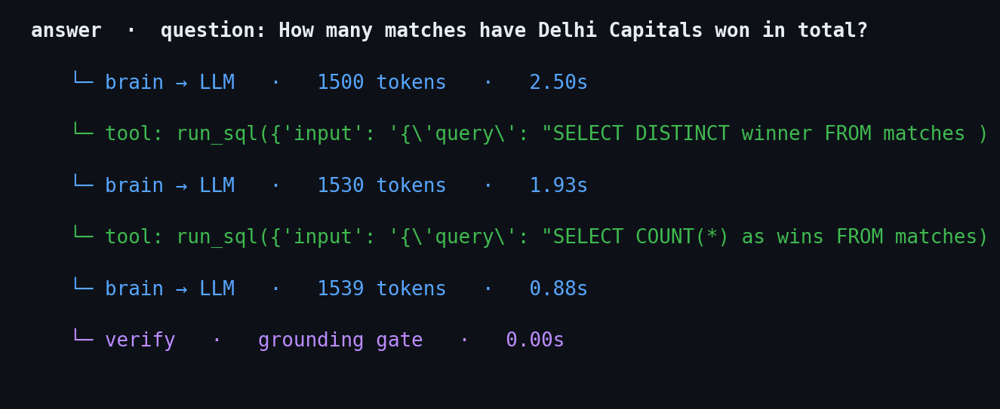

# IPL Analyst Agent

A **grounded** data-analyst agent built with [LangGraph](https://langchain-ai.github.io/langgraph/). Ask an IPL cricket database questions in plain English; the agent explores the schema, writes SQL, runs it, self-corrects, and answers **only from real rows** — refusing when the data can't answer and asking when a question is ambiguous. Every number is verified to have come from the database, never from the model.

> *"Which team has won the most IPL matches overall?"* → the agent looks up the schema, writes `SELECT winner, COUNT(*) … GROUP BY winner ORDER BY … LIMIT 1`, runs it, and answers **"Mumbai Indians, 155 wins"** — a number computed by SQLite, checked by a verifier before it reaches you.

## The app



Chat over the IPL database in plain English: grounded answers, charts with a
**Download** button, and a **"SQL the agent ran"** expander for transparency. Bring
your own OpenAI-compatible key in the sidebar — the app never uses anyone else's.

## Architecture

The agent is a graph with two feedback loops: one to gather data, one to fix itself.



| Node | Job |
|---|---|
| **brain** | The LLM. Decides which tool to call, writes SQL, reads rows, phrases the answer. |
| **tools** | Runs the requested tool: `get_schema`, `find_player`, `run_sql` (read-only), or `plot` (charts). Paused for approval in human-in-the-loop mode. |
| **verify** | A deterministic gate: every number in the answer must trace to a `run_sql` result (or the user's own question), else it bounces back to **brain** to re-derive (max 2 retries). |

**Loop 1** (`brain → tools → brain`) gathers data. **Loop 2** (`brain → verify → brain`) is self-correction. The answer only leaves the graph once `verify` accepts it.

## The grounding guarantee

Three layers, structural first:

1. **`run_sql` is read-only** — the SQLite connection is opened in `mode=ro`, so writes are *mechanically impossible*, not merely discouraged.
2. **Numbers come only from tools** — the model is instructed to answer solely from returned rows, with three honest outcomes: **answer / clarify / refuse**.
3. **The verifier** — a deterministic check that blocks any number the model didn't get from a query. A memorised or hallucinated figure cannot pass.

## Concepts (each built in one stage)

| Concept | Where |
|---|---|
| Grounded tools + structural read-only guard | `src/tools.py` |
| The agent loop (nodes / edges / state) | `src/agent.py` |
| Multiple tools + routing by name | `get_schema`, `find_player` |
| State reducer (`add_messages`) | `State` in `src/agent.py` |
| Persistence, `thread_id`, multi-user memory | `MemorySaver` checkpointer |
| Human-in-the-loop pause/resume | `interrupt_before=["tools"]` (`ask()`) |
| Three outcomes: answer / clarify / refuse | system prompt + `find_player` |
| When *not* to use RAG; curation + entity resolution | `src/reference.py` |
| Evals that assert the value + grounding | `tests/eval_agent.py` |
| Independent deterministic verification | `verify` node |
| Safe visualizer (bar/line/combo, secondary axis) | `plot` tool, `src/tools.py` |
| Observability / tracing | LangSmith ([`docs/OBSERVABILITY.md`](docs/OBSERVABILITY.md)) |

## Visualizer

For a series (runs per season) or a comparison (two players), the agent draws a
chart with the **`plot`** tool and renders it in the app with a **download button**.
This is the *safe* design: the agent passes only **data + chart type** — it never
runs arbitrary code — so charts stay grounded in real `run_sql` rows. Supports
single/multi-series, bar or line, and **combo charts with a secondary y-axis**
(e.g. strike-rate as bars, runs as a line) for quantities on different scales.

## Example outputs

The agent draws charts from real query rows (single series, comparisons, and
dual-axis combos), each downloadable in the app.

**Single series** — runs per season:



**Comparison** — two players, grouped bars aligned on the shared year axis:



**Combo, dual-axis** — strike-rate as bars (left axis) and runs as a line (right
axis), for quantities on different scales:



### Tracing (LangSmith)

Every question is **one trace** — the brain / tool / verify spans with token counts
and latency. This is real run data pulled from LangSmith:



See [`docs/OBSERVABILITY.md`](docs/OBSERVABILITY.md) for how to read the run tree.
The live UI is at smith.langchain.com → project `ipl-analyst-agent`.

## Data

Built from [Cricsheet](https://cricsheet.org) IPL ball-by-ball JSON:

- **matches** — 1,243 rows, one per game (teams, venue, result, player-of-match).
- **deliveries** — 295,732 rows, one per ball (batter, bowler, runs, wicket).

Seasons 2008–2026. The DB and raw files are gitignored; rebuild from scratch with one command.

## Run it

```bash
python3 -m venv .venv && ./.venv/bin/python -m pip install -r requirements.txt
```

Copy the env template and fill in your key(s) — `.env` is gitignored:

```bash
cp .env.example .env
```

You need **one** model key (e.g. `OLLAMA_API_KEY`, or point it at OpenAI/DeepSeek);
LangSmith tracing is optional. See [`.env.example`](.env.example) for every variable
and where to get each key.

Build the database (self-downloads the raw data), then launch:

```bash
./.venv/bin/python scripts/build_cricket_db.py
./.venv/bin/streamlit run app.py
```

**Trying the app:** it asks for **your own** OpenAI-compatible API key in the sidebar
(OpenAI, Ollama Cloud, DeepSeek, …) — nothing is baked in, so it never uses another
person's keys. Set the base URL + model for non-OpenAI endpoints. LangSmith tracing is
**off by default** (opt-in toggle). The `.env` keys above are only a fallback for the
CLI/tests and local dev.

Command-line demos:

```bash
./.venv/bin/python src/agent.py        # human-in-the-loop approve/reject demo
./.venv/bin/python tests/eval_agent.py # the scoreboard (11/11)
./.venv/bin/python tests/test_verifier.py
./.venv/bin/python tests/test_plot.py
```

## Tests

- **`tests/eval_agent.py`** — 11/11. Asserts the *actual value* (736, 973, 125, 155, 0, …), that each value is *grounded* in a real `run_sql` result, plus refuse/clarify outcomes, "must-stay-quiet" cases (no over-refusing or over-clarifying), a player-vs-player case, and a chart case.
- **`tests/test_verifier.py`** — 5/5. Unit-tests the verifier on synthetic trajectories.
- **`tests/test_plot.py`** — 4/4. Model-free tests of the chart tool: single, comparison, line, and combo (bars + line on a secondary axis).

## Design docs

- [`docs/DECISIONS.md`](docs/DECISIONS.md) — finalised choices and what was rejected.
- [`docs/ROADMAP.md`](docs/ROADMAP.md) — the journey and the pushbacks that changed the design.
- [`docs/BUGS.md`](docs/BUGS.md) — the bug journal, grouped by lesson (grounded-but-wrong zeros, an over-eager gate, a test that was itself wrong).
- [`docs/OBSERVABILITY.md`](docs/OBSERVABILITY.md) — LangSmith tracing: how the agent is instrumented, reading the run tree, and interview Q&A.

## Guardrails

Analysis only — no betting, no advice. The model never writes a number; it routes questions to tools that can prove their answers, and abstains when it can't.
